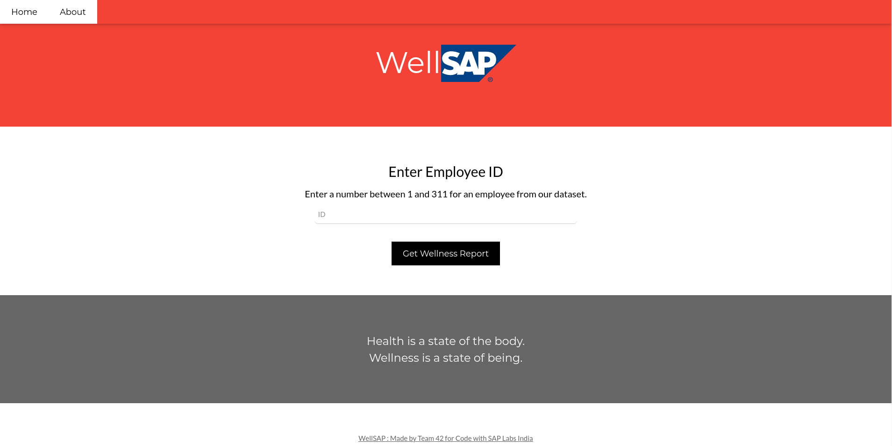
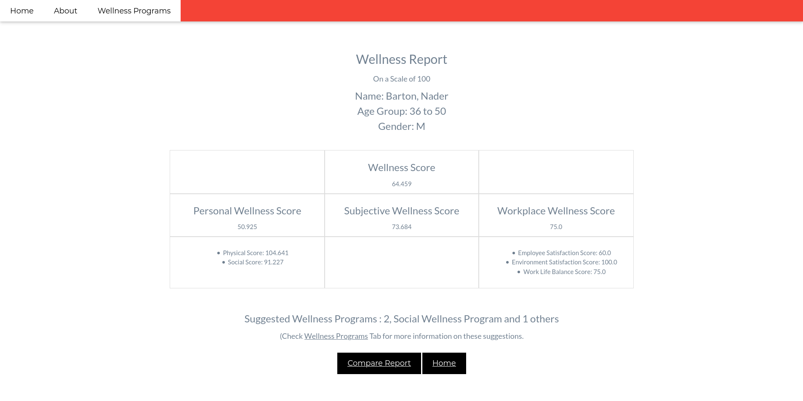

# WellSAP
## Introduction
- Wellness is not a single entity, multiple factors are involved behind an individual’s wellness.
- We have created clusters of an individual’s acquirable data points to form different Level-2 wellness scores, which are then combined to form broader Level-1 wellness scores and ultimately a Final overall Wellness score is calculated.
- The wellness is first broken into broader clusters (Level-1) which divide the individual’s wellness into Work, Personal and Mental.
- Then the broader clusters are again broken down into focused clusters (Level-2) which anchor on specific activities and aspects of the employee such as work life balance, physical aspect, work environment, social activity, and job satisfaction.
- This approach helps understand the wellness on a nuclear level and allows the company to analyze the organization’s wellness on multiple levels and work on focused aspects to improve it rather than vast approaches. 
## Objectives
1.   Identification of metrics related to wellness of an employee
2.   Provide a Wellness score for an employee
     2.1  Both physical and mental wellbeing to be considered.
     2.2  Relevancy for most of the organization's population to avoid skewed data.
3.   Identification of the collective metrics to come up with more meaningful strategy for wellness programs.
## Clusters
The final level of Wellness score is divided into broader Level-1 wellness scores. The Level-1 Wellness are then again sub divided into focused Level-2 Wellness scores.
#### **Level-1 Wellness**:
1.  *Personal Score*: These features reflect the personal attributes of the employee such as physical and social wellbeing of an employee.
2.  *Workplace Score*: These features reflect all aspects of the working life of the employee from the quality of working environment to how the employee feel about their work and finally how they are able to balance their work with their lives.
3.  *Subjective Score*:  These features show the way individuals behave as well as their psychological state.
#### **Personal Level-2 Wellness**:
1.   *Physical Score*: These features show the daily physical habits and behaviour related to overall health and quality of life of the employee.
2.   *Social Score*: These feature reflect about supportive relationships of the employee with individuals, groups and communities.
#### **Workplace Level-2 Wellness**:
1.   *Work-Life Balance*: These features contemplate the equilibrium between the employee’s personal life and career.
2.   *Employee Satisfaction*: These features indicate the satisfaction of the employee with their job and all aspects related to it.
3.   *Work Environment Satisfaction*: These features depict the employee’s satisfaction with the environment in which they operate and work.
<!--  -->
## Limitations
1.   This is a Proof of Concept of the proposed solution.
2.   We have used randomly acquired datasets which do not reflect the insights obtainable from real-world data.
3.   Given the nature of data, the models generated are not reliable but only serve the purpose of implementation.
4.   For the proper functioning of the solution, the models need to be trained on organization’s internal data, which would be reliable and would provide the user with better understanding of the solution and deliver efficient results.
## Instruction
```
$ conda env create -f environment.yml
$ conda activate well_sap
$ python3 app.py
```
**Note**:
1. Make sure you have Anaconda installed
2. If the website doesn't load itself, On your default browser, open `127.0.0.1:5000/`

## Demonstration of Project
1.  [Presentation of Project](https://docs.google.com/presentation/d/1cv6sRxbPHTNtnwxooYTCTiAdCu6XyFfHw2Ha6z4JWoc/edit?usp=sharing)
2.  Demo Video
## Screenshots
#### 1. Home Page


#### 2. Employee ID Page


####  3. Employee Form Page


####  4. Employee Wellness Report Page


## Contributors
1.  [*Aadit Agarwal*](https://github.com/aaditagarwal/)
2.  [*Aastha Jain*](https://github.com/aasthajain12/)
3.  [*Himanshu Ruhela*](https://github.com/verdantfire/)